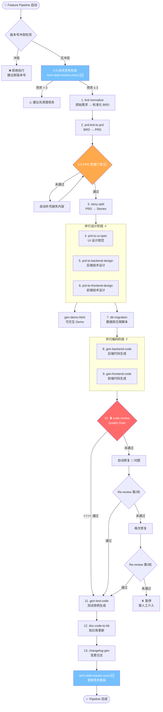

# Skills 架构全景图

> 本文档基于 **Agency Agents Platform** 项目的 `skills/` 目录，系统梳理当前 23 个 Agent Skill 的分层架构、工作流编排、依赖关系与数据流。每个 Skill 均以 `SKILL.md` 声明式定义，由 `pipeline-orchestrator` 统一调度。Pipeline 默认采用 **Review-First 模式**（规划 → 设计评审 → 编码 → 代码审查），借鉴 Kiro Spec-Driven Development 理念。

---

## 目录

1. [Skill 清单总览](#1-skill-清单总览)
2. [分层架构](#2-分层架构)
3. [Feature 工作流完整流水线](#3-feature-工作流完整流水线)
4. [五种工作流对比](#4-五种工作流对比)
5. [Skill 间依赖关系与数据流](#5-skill-间依赖关系与数据流)
6. [Quality Gates 机制](#6-quality-gates-机制)
7. [目录结构](#7-目录结构)
8. [最近新增与增强](#8-最近新增与增强)

---

## 1. Skill 清单总览

共 **23 个 Skill**，按生命周期阶段分为 7 层：

| # | Skill 名称 | 类别 | 描述 |
|---|-----------|------|------|
| 1 | `pipeline-orchestrator` | 🎯 编排层 | AI 开发 Pipeline 编排器，默认 Review-First 模式，三阶段 + 两道门禁 |
| 2 | `brd-normalize` | 📋 需求阶段 | 将原始业务需求标准化为 BRD 文档 |
| 3 | `prd-brd-to-prd` | 📋 需求阶段 | BRD → PRD 产品需求文档（含质量门禁） |
| 4 | `story-split` | 📋 需求阶段 | PRD → Epic → Story → Task 拆分 |
| 5 | `prd-to-ui-spec` | 🎨 设计阶段 | PRD → UI 设计规范文档 |
| 6 | `prd-to-backend-design` | 🎨 设计阶段 | PRD → 后端技术设计文档 |
| 7 | `prd-to-frontend-design` | 🎨 设计阶段 | PRD → 前端技术设计文档 |
| 8 | `gen-demo-html` | 🎨 设计阶段 | 基于 BRD/PRD 生成可交互 HTML Demo |
| 9 | `design-review` | ⛔ 门禁层 | 🆕 设计评审，生成变更清单摘要，供人工审批（Gate 1） |
| 10 | `db-migration` | 🔧 编码阶段 | Schema 变更 → 安全的数据库迁移脚本 |
| 11 | `gen-backend-code` | 🔧 编码阶段 | 读取后端设计文档，生成/修改后端代码 |
| 12 | `gen-frontend-code` | 🔧 编码阶段 | 读取前端设计文档，生成/修改前端代码 |
| 13 | `code-review` | ✅ 质量阶段 | 代码审查（含 PRD 非功能需求覆盖检查）（Gate 2） |
| 14 | `gen-test-code` | ✅ 质量阶段 | 自动生成测试用例（单元/集成/E2E） |
| 15 | `bug-fix` | 🐛 维护阶段 | Bug 分析与修复 |
| 16 | `refactor` | 🐛 维护阶段 | 代码重构 |
| 17 | `doc-code-to-kb` | 📚 知识阶段 | 代码/文档 → 知识库（KB）更新 |
| 18 | `kb-qa` | 📚 知识阶段 | 基于知识库的问答与审查 |
| 19 | `changelog-gen` | 📦 发布阶段 | 自动生成版本变更日志 |
| 20 | `deploy-check` | 📦 发布阶段 | 部署前检查清单 |
| 21 | `sprint-report` | 📦 发布阶段 | Sprint 回顾报告生成 |
| 22 | `api-doc-gen` | 📦 发布阶段 | 生成 OpenAPI 3.0 API 文档 |
| 23 | `tech-debt-tracker` | 🔍 治理层 | 技术债务追踪与管理 |

---

## 2. 分层架构

```
┌─────────────────────────────────────────────────────────────────────────────┐
│                         🎯 编排层 (Orchestration)                           │
│                                                                             │
│                       ┌─────────────────────────┐                           │
│                       │  pipeline-orchestrator   │                           │
│                       │  ─────────────────────   │                           │
│                       │  • Feature 工作流        │                           │
│                       │  • Bug 工作流            │                           │
│                       │  • Refactor 工作流       │                           │
│                       │  • Hotfix 工作流         │                           │
│                       │  • Planning-Only 工作流  │                           │
│                       │  • Quality Gates ⛔      │                           │
│                       │  • 断点恢复 ⏯️           │                           │
│                       │  • 技术债务检查 🆕       │                           │
│                       └────────────┬────────────┘                           │
│                                    │                                        │
└────────────────────────────────────┼────────────────────────────────────────┘
                                     │ 调度
     ┌───────────────────────────────┼───────────────────────────────┐
     │                               │                               │
     ▼                               ▼                               ▼
┌──────────────────┐  ┌──────────────────────────┐  ┌──────────────────────┐
│ 📋 需求阶段       │  │ 🎨 设计阶段               │  │ 🔧 编码阶段           │
│                  │  │                          │  │                      │
│ brd-normalize    │  │ prd-to-ui-spec           │  │ db-migration         │
│      ↓           │  │ prd-to-backend-design  ∥ │  │ gen-backend-code   ∥ │
│ prd-brd-to-prd   │  │ prd-to-frontend-design ∥ │  │ gen-frontend-code  ∥ │
│      ↓           │  │ gen-demo-html            │  │                      │
│ story-split      │  │                          │  │                      │
└────────┬─────────┘  └────────────┬─────────────┘  └──────────┬───────────┘
         │                         │                            │
         └─────────────────────────┼────────────────────────────┘
                                   │
                                   ▼
┌─────────────────────────────────────────────────────────────────────────────┐
│                         ✅ 质量阶段 (Quality Gates)                         │
│                                                                             │
│  ┌──────────────────────────────┐    ┌──────────────────────────────┐       │
│  │       code-review ⛔         │    │       gen-test-code           │       │
│  │  ─────────────────────────   │    │  ─────────────────────────   │       │
│  │  • 类型安全                  │    │  • 单元测试                   │       │
│  │  • 错误处理                  │    │  • 集成测试                   │       │
│  │  • 安全性                    │    │  • E2E 测试                   │       │
│  │  • KB 一致性                 │    │                              │       │
│  │  • PRD 非功能需求覆盖 🆕     │    │                              │       │
│  │  • 架构模式合规 🆕           │    │                              │       │
│  │  • 反模式检测 🆕             │    │                              │       │
│  │  • 反馈闭环 (最多3轮)        │    │                              │       │
│  └──────────────────────────────┘    └──────────────────────────────┘       │
│                                                                             │
└─────────────────────────────────────────────────────────────────────────────┘
                                   │
                                   ▼
┌──────────────────┐  ┌──────────────────┐  ┌──────────────────────────────┐
│ 📚 知识阶段       │  │ 📦 发布阶段       │  │ 🐛 维护阶段                   │
│                  │  │                  │  │                              │
│ doc-code-to-kb   │  │ changelog-gen    │  │ bug-fix                      │
│ kb-qa            │  │ deploy-check     │  │ refactor                     │
│                  │  │ sprint-report    │  │                              │
│                  │  │ api-doc-gen      │  │                              │
└──────────────────┘  └──────────────────┘  └──────────────────────────────┘
                                   │
                                   ▼
┌─────────────────────────────────────────────────────────────────────────────┐
│                         🔍 治理层 (Governance)                              │
│                                                                             │
│                       ┌─────────────────────────┐                           │
│                       │   tech-debt-tracker 🆕   │                           │
│                       │  ─────────────────────   │                           │
│                       │  • scan  全量扫描         │                           │
│                       │  • check 快速检查         │                           │
│                       │  • resolve 标记已修复     │                           │
│                       │  • 优先级自动升级         │                           │
│                       └─────────────────────────┘                           │
│                                                                             │
└─────────────────────────────────────────────────────────────────────────────┘
```

> **设计理念**：采用"洋葱模型"分层——编排层在最外层统一调度，业务 Skill 按生命周期排列在中间，治理层在最底层兜底。每一层只依赖下一层的输出，不跨层调用。

---

## 3. Feature 工作流完整流水线

Feature 工作流是最完整的 Pipeline，覆盖从需求到发布的全生命周期：



### 步骤详解

| 步骤 | Skill | 输入 | 输出 | 是否可跳过 |
|------|-------|------|------|-----------|
| 0.5 | `tech-debt-tracker` (check) | 上版本 Review 报告 | 债务清单 + 建议 | ❌ 不可跳过 |
| 1 | `brd-normalize` | 原始需求文本 | `version-doc/{ver}/brd/brd.md` | ❌ |
| 2 | `prd-brd-to-prd` | BRD 文档 | `version-doc/{ver}/prd/prd.md` | ❌ |
| 2.5 | PRD 质量门禁 | PRD 文档 | 通过/不通过 + 缺失项 | ❌ |
| 3 | `story-split` | PRD 文档 | `version-doc/{ver}/stories/*.md` | ⚠️ 小需求可跳过 |
| 4 | `prd-to-ui-spec` | PRD 文档 | `version-doc/{ver}/design/ui-spec.md` | ⚠️ 纯后端可跳过 |
| 5 | `prd-to-backend-design` | PRD + KB | `version-doc/{ver}/design/backend-design.md` | ⚠️ 纯前端可跳过 |
| 6 | `prd-to-frontend-design` | PRD + KB | `version-doc/{ver}/design/frontend-design.md` | ⚠️ 纯后端可跳过 |
| 7 | `db-migration` | 后端设计文档 | 迁移脚本 | ⚠️ 无 Schema 变更可跳过 |
| 8 | `gen-backend-code` | 后端设计 + KB | 后端源码 | ❌ |
| 9 | `gen-frontend-code` | 前端设计 + KB | 前端源码 | ❌ |
| 10 | `code-review` ⛔ | 生成的代码 + PRD | Review 报告 | ❌ 不可跳过 |
| 11 | `gen-test-code` | 代码 + PRD 验收标准 | 测试文件 | ❌ |
| 12 | `doc-code-to-kb` | 新增/修改的代码 | KB 文档更新 | ❌ 不可跳过 |
| 13 | `changelog-gen` | 版本所有产出物 | `version-doc/{ver}/CHANGELOG.md` | ❌ |
| 14 | `tech-debt-tracker` (scan) | Review 报告 | 债务看板更新 | ❌ 不可跳过 |

---

## 4. 五种工作流对比

`pipeline-orchestrator` 支持 5 种工作流类型，每种自动选择不同的 Skill 组合：

| 步骤 | 🚀 Feature | 🐛 Bug | ♻️ Refactor | 🔥 Hotfix | 📋 Planning |
|------|-----------|--------|------------|----------|------------|
| 技术债务检查 | ✅ | ✅ | ✅ | ✅ | — |
| `brd-normalize` | ✅ | — | — | — | ✅ |
| `prd-brd-to-prd` | ✅ | — | — | — | ✅ |
| `story-split` | ✅ | — | — | — | ✅ |
| `prd-to-ui-spec` | ✅ | — | — | — | ✅ |
| `prd-to-backend-design` | ✅ ∥ | — | — | — | ✅ ∥ |
| `prd-to-frontend-design` | ✅ ∥ | — | — | — | ✅ ∥ |
| `db-migration` | ✅ | — | — | — | — |
| `gen-backend-code` | ✅ ∥ | — | — | — | — |
| `gen-frontend-code` | ✅ ∥ | — | — | — | — |
| `bug-fix` | — | ✅ | — | ✅ | — |
| `refactor` | — | — | ✅ | — | — |
| **⛔ `code-review`** | **✅** | **✅** | **✅** | **✅** | — |
| `gen-test-code` | ✅ | ✅ | ✅ | ⚠️ 跳过 | — |
| `doc-code-to-kb` | ✅ | ✅ | ✅ | ✅ | — |
| `changelog-gen` | ✅ | — | — | — | — |
| `deploy-check` | — | — | — | ✅ | — |
| `sprint-report` | — | — | — | — | — |
| `api-doc-gen` | — | — | — | — | — |
| `tech-debt-tracker` (scan) | ✅ | — | — | — | — |

> **∥** 表示并行执行。**⛔** 表示 Quality Gate，不可跳过。

### 各工作流触发场景

| 工作流 | 触发场景 | 典型耗时 |
|--------|---------|---------|
| 🚀 **Feature** | 新功能开发（从需求到上线） | 全量 Pipeline，13+ 步 |
| 🐛 **Bug** | 日常 Bug 修复 | 4 步：分析 → 修复 → Review → KB |
| ♻️ **Refactor** | 代码质量改进 | 4 步：分析 → 重构 → Review → KB |
| 🔥 **Hotfix** | 紧急线上修复 | 3 步：修复 → Review → KB（跳过测试） |
| 📋 **Planning** | 仅做需求规划，不写代码 | 6 步：BRD → PRD → Stories → 设计 |

---

## 5. Skill 间依赖关系与数据流

### 核心数据流

```
                     ┌──────────────────────────────────────────┐
                     │            知识库 (kb/)                    │
                     │  ┌─────────────────────────────────────┐ │
                     │  │ server/  frontend/  architecture/   │ │
                     │  │ 00_project_map  01_index_api  ...   │ │
                     │  └─────────────────────────────────────┘ │
                     └──────────┬───────────────────────────────┘
                                │ 读取 ↑ 写入
           ┌────────────────────┼────────────────────┐
           │                    │                    │
     ┌─────┴──────┐    ┌───────┴───────┐    ┌───────┴───────┐
     │ 需求 Skills │    │ 编码 Skills    │    │ 质量 Skills    │
     │ 读取 KB     │    │ 读取 KB       │    │ 读取 KB       │
     │ 参考现有架构 │    │ 遵循现有模式   │    │ 对比现有规范   │
     └────────────┘    └───────────────┘    └───────────────┘
                                │
                                ▼ 写入
                     ┌──────────────────────┐
                     │   doc-code-to-kb     │
                     │   更新知识库          │
                     └──────────────────────┘
```

### 三大共享数据源

| 数据源 | 路径 | 作用 | 读取方 | 写入方 |
|--------|------|------|--------|--------|
| **知识库 (KB)** | `kb/` | 项目架构模式、API 索引、组件清单 | 所有 Skill | `doc-code-to-kb` |
| **版本文档** | `version-doc/{ver}/` | BRD、PRD、设计文档、Review 报告 | 下游 Skill | 各阶段 Skill |
| **源代码** | `web/`、`server/` | 实际项目代码 | 编码/质量 Skill | 编码 Skill |

### Skill 间的输入输出链

```
brd-normalize
  └─ 输出: brd.md ──→ prd-brd-to-prd
                        └─ 输出: prd.md ──→ story-split
                        │                    └─ 输出: stories/*.md
                        │
                        ├──→ prd-to-ui-spec
                        │     └─ 输出: ui-spec.md
                        │
                        ├──→ prd-to-backend-design  ──→ gen-backend-code
                        │     └─ 输出: backend-design.md    └─ 输出: 后端源码
                        │
                        ├──→ prd-to-frontend-design ──→ gen-frontend-code
                        │     └─ 输出: frontend-design.md   └─ 输出: 前端源码
                        │
                        └──→ db-migration
                              └─ 输出: 迁移脚本

gen-backend-code + gen-frontend-code
  └─ 输出: 源码 ──→ code-review
                      └─ 输出: review-report.md ──→ gen-test-code
                                                      └─ 输出: 测试文件

所有新增/修改的代码
  └──→ doc-code-to-kb
         └─ 输出: KB 文档更新

所有版本产出物
  └──→ changelog-gen
         └─ 输出: CHANGELOG.md

所有 Review 报告
  └──→ tech-debt-tracker
         └─ 输出: 债务看板
```

---

## 6. Quality Gates 机制

Quality Gates（质量门禁）是 Pipeline 中**不可跳过**的检查点，确保产出物质量：

### Gate 1：PRD 质量门禁（prd-brd-to-prd 内置）

在 PRD 生成后自动执行 10 项检查：

| # | 检查项 | 说明 |
|---|--------|------|
| 1 | 功能需求完整性 | 每个功能点有明确的输入/输出/流程 |
| 2 | 交互流程 | 包含用户操作步骤和页面跳转 |
| 3 | 异常场景 | 覆盖错误处理、边界条件 |
| 4 | 验收标准 | 每个功能有可测试的验收条件 |
| 5 | 非功能需求 | 性能、安全、可访问性要求 |
| 6 | 数据模型 | 涉及的数据结构和字段定义 |
| 7 | API 接口 | 前后端交互的接口定义 |
| 8 | 权限控制 | 角色和权限要求 |
| 9 | 兼容性 | 浏览器/设备兼容要求 |
| 10 | 依赖分析 | 与现有功能的关联影响 |

> 未通过时自动补充缺失内容并重新检查，最多 2 轮。

### Gate 2：Code Review 质量门禁（code-review）

代码审查覆盖 7 大维度：

| 维度 | 检查内容 |
|------|---------|
| 🔒 安全性 | XSS/CSRF 防护、输入校验、敏感数据处理 |
| 🏗️ 架构合规 | 是否遵循 KB 中记录的架构模式 |
| 📐 类型安全 | TypeScript 类型定义完整性 |
| ⚠️ 错误处理 | try-catch 覆盖、错误边界、用户提示 |
| 📏 KB 一致性 | API 封装、组件命名是否与现有代码一致 |
| 📋 PRD 覆盖 | 非功能需求（性能/安全/可访问性）是否实现 |
| 🚫 反模式 | 检测常见反模式（硬编码、魔法数字等） |

**评分标准**：

| 评级 | 含义 | 后续动作 |
|------|------|---------|
| ⭐⭐⭐⭐⭐ | 优秀，无问题 | 直接通过 |
| ⭐⭐⭐⭐ | 良好，仅有 🟢 建议 | 直接通过 |
| ⭐⭐⭐ | 合格，有 🟡 问题 | 通过，🟡 记入技术债务 |
| ⭐⭐ | 不合格，有 🔴 问题 | 自动修复后 Re-review |
| ⭐ | 严重问题 | 自动修复后 Re-review |

**反馈闭环**：最多 3 轮 Review → Fix → Re-review，超过 3 轮暂停等待人工介入。

### Gate 3：技术债务门禁（tech-debt-tracker）

Pipeline 启动前检查遗留债务：

| 债务数量 | 处理策略 |
|----------|---------|
| 0 | ✅ 直接开始 |
| 1-3 | ⚠️ 提醒，继续执行 |
| > 3 | 🔴 建议先清理，但不强制阻断 |

---

## 7. 目录结构

```
skills/                              # 22 个 Skill
│
├── pipeline-orchestrator/           # 🎯 编排层 — 总指挥
│   └── SKILL.md
│
│── ── 📋 需求阶段 ── ── ── ── ── ── ── ── ── ── ── ── ── ──
│
├── brd-normalize/                   # 原始需求 → 标准化 BRD
│   ├── SKILL.md
│   └── references/
│       └── output-template.md       # BRD 输出模板
│
├── prd-brd-to-prd/                  # BRD → PRD（含质量门禁）
│   ├── SKILL.md
│   └── references/
│       └── prd-template.md          # PRD 输出模板
│
├── story-split/                     # PRD → Stories 拆分
│   └── SKILL.md
│
│── ── 🎨 设计阶段 ── ── ── ── ── ── ── ── ── ── ── ── ── ──
│
├── prd-to-ui-spec/                  # PRD → UI 设计规范
│   └── SKILL.md
│
├── prd-to-backend-design/           # PRD → 后端技术设计
│   ├── SKILL.md
│   └── references/
│       └── be-design-template.md    # 后端设计模板
│
├── prd-to-frontend-design/          # PRD → 前端技术设计
│   ├── SKILL.md
│   └── references/
│       └── fe-design-template.md    # 前端设计模板
│
├── gen-demo-html/                   # 生成可交互 HTML Demo
│   └── SKILL.md
│
│── ── 🔧 编码阶段 ── ── ── ── ── ── ── ── ── ── ── ── ── ──
│
├── db-migration/                    # 数据库迁移脚本
│   └── SKILL.md
│
├── gen-backend-code/                # 后端代码生成
│   └── SKILL.md
│
├── gen-frontend-code/               # 前端代码生成
│   └── SKILL.md
│
│── ── ✅ 质量阶段 ── ── ── ── ── ── ── ── ── ── ── ── ── ──
│
├── code-review/                     # 代码审查（Quality Gate）
│   └── SKILL.md
│
├── gen-test-code/                   # 测试用例生成
│   └── SKILL.md
│
│── ── 🐛 维护阶段 ── ── ── ── ── ── ── ── ── ── ── ── ── ──
│
├── bug-fix/                         # Bug 分析与修复
│   └── SKILL.md
│
├── refactor/                        # 代码重构
│   └── SKILL.md
│
│── ── 📚 知识阶段 ── ── ── ── ── ── ── ── ── ── ── ── ── ──
│
├── doc-code-to-kb/                  # 代码/文档 → 知识库更新
│   ├── SKILL.md
│   ├── references/                  # 10 个文档模板
│   │   ├── doc-koa-middleware.md     # Koa 中间件文档模板
│   │   ├── doc-koa-model.md         # Koa Model 文档模板
│   │   ├── doc-koa-route.md         # Koa 路由文档模板
│   │   ├── doc-koa-service.md       # Koa Service 文档模板
│   │   ├── doc-react-api.md         # React API 层文档模板
│   │   ├── doc-react-component.md   # React 组件文档模板
│   │   ├── doc-react-page.md        # React 页面文档模板
│   │   ├── doc-react-store.md       # React Store 文档模板
│   │   ├── doc-react-types.md       # React 类型文档模板
│   │   └── project_map_monorepo.md  # 项目地图模板（Monorepo）
│   └── scripts/                     # 5 个自动化脚本
│       ├── detect_changes.py        # 变更检测
│       ├── gen_progress.py          # 进度生成
│       ├── generate_kb.py           # KB 生成
│       ├── scan_project.py          # 项目扫描
│       └── verify_kb.py             # KB 验证
│
├── kb-qa/                           # 基于知识库的问答
│   ├── SKILL.md
│   └── references/
│       ├── kb-lookup-guide.md       # KB 查找指南
│       ├── qa-template.md           # QA 模板
│       └── review-template.md       # Review 模板
│
│── ── 📦 发布阶段 ── ── ── ── ── ── ── ── ── ── ── ── ── ──
│
├── changelog-gen/                   # 变更日志生成
│   └── SKILL.md
│
├── deploy-check/                    # 部署前检查
│   └── SKILL.md
│
├── sprint-report/                   # Sprint 报告
│   └── SKILL.md
│
├── api-doc-gen/                     # API 文档生成
│   └── SKILL.md
│
│── ── 🔍 治理层 ── ── ── ── ── ── ── ── ── ── ── ── ── ── ──
│
└── tech-debt-tracker/               # 技术债务追踪 🆕
    └── SKILL.md
```

---

## 8. 最近新增与增强

### 🆕 新增 Skill

| Skill | 描述 | 解决的问题 |
|-------|------|-----------|
| `tech-debt-tracker` | 技术债务追踪器 | Code Review 中的 🟡 问题无人跟进，债务累积 |

### 🆕 增强的 Skill

| Skill | 增强内容 | 解决的问题 |
|-------|---------|-----------|
| `pipeline-orchestrator` | 第 0.5 步：技术债务检查 | 新版本开发前不知道有多少遗留问题 |
| `pipeline-orchestrator` | KB 更新步骤不可跳过 | 知识库与代码脱节 |
| `prd-brd-to-prd` | 第 5.5 步：PRD 质量门禁（10 项检查） | PRD 缺少交互流程、异常场景、验收标准 |
| `code-review` | PRD 非功能需求覆盖检查 | 安全性、性能等非功能需求被遗漏 |
| `code-review` | 架构模式合规检查 | 新代码不遵循 KB 中记录的架构模式 |
| `code-review` | 反模式检测 | 硬编码、魔法数字等常见问题未被发现 |

### 借鉴的外部框架

| 框架 | 借鉴内容 |
|------|---------|
| **BMAD-METHOD** | 21 个 Agent 角色定义、Story 拆分模板、QA Agent 审查清单 |
| **awesome-cursorrules** | 30+ 技术栈的 Rules 模板，React/TypeScript/TailwindCSS 编码规范 |
| **ChatDev** | 多 Agent 协作流程，Code Reviewer 和 Test Engineer 角色定义 |
| **Zencoder** | Quality Gates 理念——每次变更自动跑 Tests + Linting + Code Review |

---

## 附录：Skill 文件规范

每个 Skill 以 `SKILL.md` 声明式定义，包含以下字段：

```yaml
name: "skill-name"
description: "一句话描述"
version: "1.0.0"
triggers:
  - type: "pipeline"        # 由 pipeline-orchestrator 调用
  - type: "manual"          # 手动触发
input:
  - name: "参数名"
    type: "string"
    required: true
    description: "参数说明"
output:
  - name: "输出名"
    type: "file"
    path: "输出路径"
steps:
  - name: "步骤名"
    action: "具体操作"
references:                  # 可选：引用的模板文件
  - "references/template.md"
```

> **设计原则**：Skill 是声明式的，不包含命令式代码。所有逻辑由 AI Agent 在运行时根据 SKILL.md 的指令动态执行。这使得 Skill 易于阅读、修改和版本管理。

---

*本文档基于 Agency Agents Platform 项目 `skills/` 目录编写，共 22 个 Skill，最后更新：2026-04-14*
