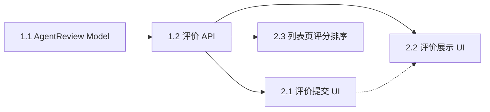

# Epic 总览 — v1.3.0

## 版本目标

构建完整的 Agent 评分评价体系，让用户能够对 Agent 进行评分和评价，并通过评分排序帮助其他用户发现优质 Agent。

## Epic 列表

| Epic | 名称 | Story 数 | 估算总工时 | 优先级 |
|------|------|---------|-----------|--------|
| E1 | Agent 评分评价（后端） | 2 | 2d | P0 |
| E2 | Agent 评分评价（前端） | 3 | 3.5d | P0/P1 |

## 依赖关系图

## Story 列表

| # | Story | Epic | 优先级 | 估算 | 依赖 | 涉及层级 |
|---|-------|------|--------|------|------|---------|
| 1.1 | AgentReview Model + Agent ratingStats 扩展 | E1 | P0 | 0.5d | 无 | 后端 Model |
| 1.2 | 评价 CRUD API | E1 | P0 | 1.5d | 1.1 | 后端 Route + Service |
| 2.1 | 评价提交 UI | E2 | P0 | 1d | 1.2 | 前端页面 + API |
| 2.2 | 评分统计 + 评价列表展示 | E2 | P1 | 1.5d | 1.2 | 前端页面 + 组件 |
| 2.3 | Agent 列表页评分排序 | E2 | P1 | 1d | 1.2 | 前端页面 + 后端 API 修改 |

## 建议实施顺序

| 顺序 | Story | 估算工时 | 依赖 | 说明 |
|------|-------|---------|------|------|
| 1 | 1.1 AgentReview Model | 0.5d | 无 | 基础数据层，最先完成 |
| 2 | 1.2 评价 CRUD API | 1.5d | 1.1 | 后端接口 |
| 3 | 2.1 评价提交 UI | 1d | 1.2 | P0 前端功能 |
| 4 | 2.2 评分统计 + 评价列表 | 1.5d | 1.2 | 可与 2.3 并行 |
| 5 | 2.3 列表页评分排序 | 1d | 1.2 | 可与 2.2 并行 |

**预估总工时**：5.5 天

## 建议 Sprint 规划

### Sprint 1（第 1 周）
| Story | 标题 | 工时 |
|-------|------|------|
| 1.1 | AgentReview Model | 0.5d |
| 1.2 | 评价 CRUD API | 1.5d |
| 2.1 | 评价提交 UI | 1d |

### Sprint 2（第 2 周）
| Story | 标题 | 工时 |
|-------|------|------|
| 2.2 | 评分统计 + 评价列表 | 1.5d |
| 2.3 | 列表页评分排序 | 1d |
